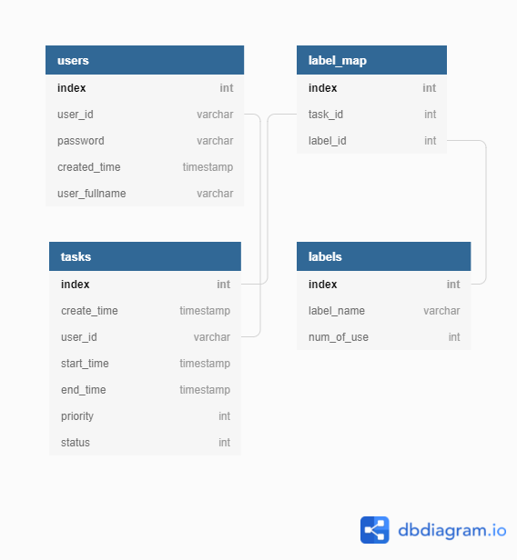

# Ruby on rails project

## Task management system
* Function:
  * Create self's task.
  * When user login, just can see theirselves' task.
  * Able to set start_time and end_time of task.
  * Able to set priority of task.
  * Able to set status of task.
  * Able to add label of task.
  * Task list, able to sorting by start_time, end_time, or priority.

* Support:
  * Latest version of macOS/Chrome.

* Development tools(latest stable version): 
  * Ruby - ruby 3.0.1p64 (2021-04-05 revision 0fb782ee38) [x86_64-linux]
  * Ruby on rails - Rails 6.1.3.2
  * PostgreSQL - psql (PostgreSQL) 12.7 (Ubuntu 12.7-0ubuntu0.20.04.1)

* Database - Table Schema

	Table users as U {

	  index int [pk, increment] // auto-increment

	  user_id varchar

	  password varchar

	  created_time timestamp

	  user_fullname varchar

	}

	Table tasks as T {

	  index int [pk, increment]

	  create_time timestamp

	  user_id varchar

	  start_time timestamp

	  end_time timestamp

	  priority int

	  status int
	}

	Ref: U.user_id < tasks.user_id  

	Table labels as L {

	  index int [pk, increment]

	  label_name varchar

	  num_of_use int
	}

	Table label_map as M {

	  index int [pk, increment]

	  task_id int

	  label_id int
	}

	Ref: L.index < M.label_id
	Ref: T.index < M.task_id

